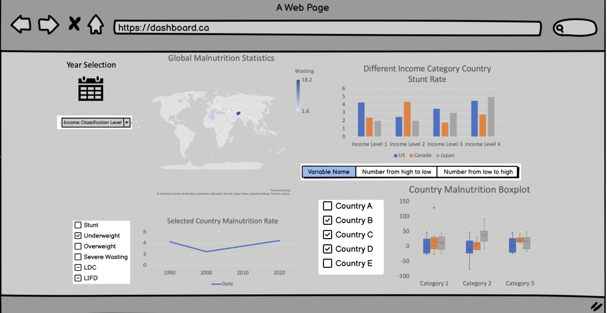

# 551_Project
## Overview

This dashboard provides visualizations of malnutrition and poverty indicators across different regions and nations. It consists of three tabs: Overview, Malnutrition, and Poverty.

## Tabs

1. **Overview**: General information about the dashboard and its functionality.
2. **Malnutrition**: Visualizes spatial distribution of seven critical malnutrition indicators using Plotly/choropleth maps and temporal distribution of fatality count.
3. **Poverty**: Visualizes spatial distribution of poverty indicators for selected nations and their temporal distribution.

## Deployment

The dashboard is deployed on Heroku and can be accessed [here](https://malnutrition-test-55a7c15e2661.herokuapp.com).

## Technologies Used

- Plotly: For creating choropleth maps to visualize spatial distributions.
- Altair: For visualizing temporal distributions of fatality count and poverty indicators.
- Heroku: Deployment platform for online access.
## Usage

To run the dashboard locally:

1. Clone this repository.
2. Install the required dependencies:
    ```
    pip install -r requirements.txt
    ```
3. Run the application:
    ```
    python app.py
    ```
4. Access the dashboard in your web browser at `http://localhost:8050`.

## Sketch

This interactive dashboard presents a comprehensive overview of global malnutrition statistics, designed to offer insights into the prevalence and distribution of malnutrition across different regions and demographics. Upon accessing the dashboard, users are greeted with a landing page that vividly displays the extent of malnutrition through various data visualization methods such as bar charts, pie charts, and density plots. These visualizations are color-coded to distinguish between different types of malnutrition, such as undernutrition, obesity, and micronutrient deficiencies.

A key feature of this dashboard is its customizable filtering options, accessible through a dropdown menu. Users can refine the displayed data to focus on specific regions, countries, or demographic groups (e.g., children under five, pregnant women). Filters can also be applied based on the severity of malnutrition and the presence of associated risk factors such as access to clean water and sanitation, dietary diversity, and healthcare access.

Another dropdown menu enables users to sort the data according to various criteria, including the prevalence rate of malnutrition, the percentage change over time, or the effectiveness of ongoing intervention programs. This functionality allows for an in-depth analysis of trends and patterns, facilitating the identification of regions or groups most in need of intervention.

The dashboard also includes an interactive section where users can compare the impact of different factors on malnutrition rates by selecting variables of interest. This feature supports comparative analyses, enabling stakeholders, policymakers, and researchers to assess the effectiveness of nutritional programs and policies.

 In summary, the dashboard serves as a vital tool for understanding and addressing the global challenge of malnutrition, offering tailored insights through advanced data visualization and filtering capabilities. It aims to empower decision-makers with the information needed to design and implement targeted nutritional interventions, ultimately contributing to the reduction of malnutrition worldwide.


